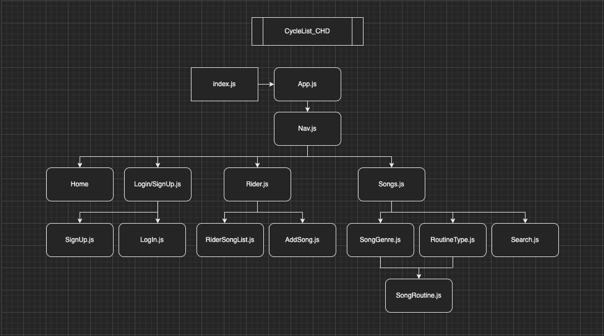
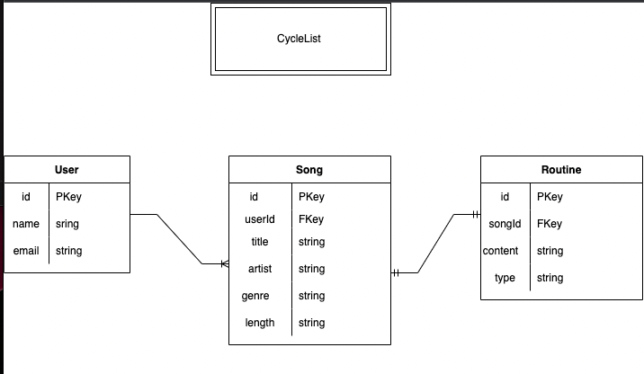
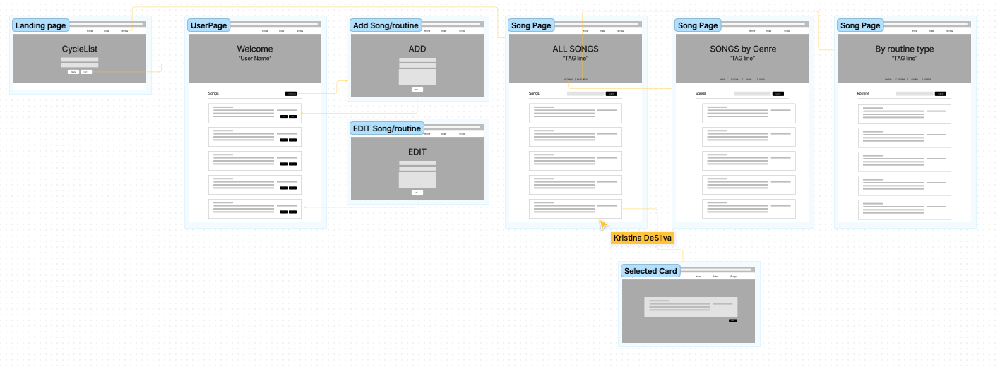

# CycleList

## 8/11/2022

### By: [Eric Deleon](https://github.com/132E), [Jeff Fraley](https://github.com/frank-booth), [Kristina DeSilva](https://github.com/kavdesilva)

---

### _Description_

#### A website for spin instructors and novices to help build indoor cycle workouts. The rider will be able to include their favorite songs with their routines for a customized, personal workout.

---

### [CycleList link]()

---

### _Languages_

- Postgresql/Sequelize
- Express
- React
- Node.js

---

### _Trello Board_

#### [Project Three - "CycleList"](https://trello.com/b/1N4S1Jx8/cyclelist)

### _Slide Deck Presentation_

[Pitch Deck - "CycleList"](https://docs.google.com/presentation/d/1FLtKpsfmaUjRKlfJIkHD1hOHDsaINoCnSSkfsbsxyUw/edit?usp=sharing)

---

### _Component Heirarchy Diagram (CHD)_

---

### _Entity Relationship Diagram (ERD)_

---

### _Wireframes_

[Figma File](https://www.figma.com/file/NtcUH9Miw0GxNS1v86WxLU/CycleList-Wire-frame?node-id=0%3A1)

---

### _Future Updates_

- [x] README.md
- [x] Trello Board
- [x] Wireframes
- [x] ERD
- [x] CHD
- [x] Books Database
- [ ] Frontend
- [ ] Backend
- [ ] Heroku Deployment

### _Post-MVP_

- [ ] Playlist Functionality
- [ ] Login Authentication

---

### _Credits_

#### [JollySpins](https://jollyspins.wordpress.com/)
